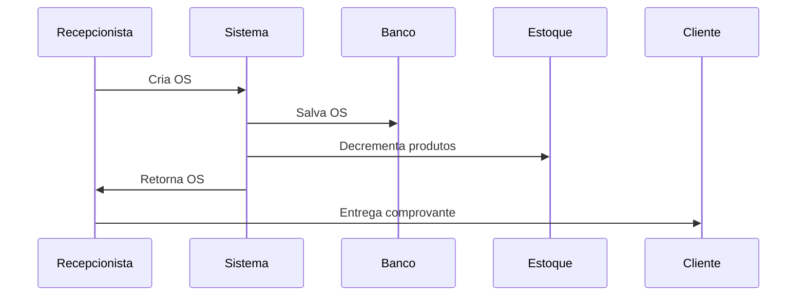

# 📌 Referência Rápida - ctrlOS Pro
## Sistema de Documentação + Desenvolvimento SaaS

---

## 🎯 Regra de Ouro

**TODA nova funcionalidade = Documentação obrigatória em `/docs/features/` ANTES do merge**

---

## 🏗️ Sobre o ctrlOS Pro

Sistema SaaS completo para gestão de assistências técnicas de informática:
- **Core:** Ordens de Serviço (OS) multi-equipamento
- **Financeiro:** Controle de caixa integrado + fiado
- **Vendas:** PDV direto + orçamentos conversíveis
- **Estoque:** Baixa automática de produtos
- **Integrações:** WhatsApp + PDF térmico/A4 + QR Code

**Stack:** Next.js 14 + TypeScript + Prisma + Supabase + shadcn/ui

---

## ⚡ Comandos Essenciais

```bash
# Desenvolvimento
npm run dev                    # Servidor local
npm run build                  # Build produção

# Banco de Dados
npx prisma migrate dev         # Criar migration
npx prisma studio              # Admin do banco
npx prisma generate            # Atualizar Prisma Client

# Documentação
npm run docs:new nome-feature  # Nova doc de feature
npm run docs:check-all         # Validar ANTES de commit
npm run docs:serve             # Visualizar docs

# Qualidade
npm run lint                   # Verificar código
npm run test                   # Rodar testes
npm run type-check             # Verificar TypeScript

# Verificação completa PRÉ-COMMIT
npm run lint && npm run test && npm run build && npm run docs:check-all
```

---

## 📂 Estrutura do Projeto ctrlOS Pro

```
ctrlOS-pro/
├── src/
│   ├── app/                   # Next.js App Router
│   │   ├── (auth)/           # Login (público)
│   │   ├── (dashboard)/      # Painel (protegido)
│   │   │   ├── os/          # Ordens de Serviço ⭐
│   │   │   ├── customers/   # Clientes
│   │   │   ├── products/    # Produtos + Estoque
│   │   │   ├── services/    # Serviços
│   │   │   ├── financial/   # Financeiro
│   │   │   ├── budgets/     # Orçamentos
│   │   │   ├── sales/       # Vendas Diretas
│   │   │   ├── reports/     # Relatórios
│   │   │   └── settings/    # Configurações
│   │   └── api/             # API Routes
│   ├── components/
│   │   ├── ui/              # shadcn/ui
│   │   ├── forms/           # Formulários
│   │   ├── tables/          # Tabelas
│   │   ├── modals/          # Dialogs
│   │   ├── pdf/             # Templates PDF
│   │   └── whatsapp/        # WhatsApp
│   ├── lib/                 # Utilidades
│   ├── hooks/               # Custom hooks
│   ├── types/               # TypeScript types
│   └── schemas/             # Validação Zod
├── prisma/
│   ├── schema.prisma        # Schema do banco ⭐
│   └── migrations/          # Migrations
├── docs/                    # Documentação ⭐
│   ├── features/           # Docs de features
│   ├── adr/                # Decisões arquiteturais
│   ├── guides/             # Guias
│   ├── api/                # Endpoints
│   └── diagrams/           # Diagramas
└── tests/                   # Testes
```

---

## 📋 Onde Colocar Cada Coisa

| O quê | Onde | Arquivo |
|-------|------|---------|
| Nova feature | `/docs/features/` | `nome-feature.md` |
| Decisão arquitetural | `/docs/adr/` | `00X-decisao.md` |
| Guia geral | `/docs/guides/` | `guia-tema.md` |
| Endpoint de API | `/docs/api/` | `endpoints.md` |
| Diagrama | `/docs/diagrams/` | `nome.png` ou `.mermaid` |
| Componente React | `src/components/` | Pasta por feature |
| Página | `src/app/(dashboard)/` | Por módulo |
| Hook customizado | `src/hooks/` | `use*.ts` |
| Schema de validação | `src/schemas/` | `*.ts` com Zod |

---

## ✅ Checklist Completa por Feature

### 📝 Documentação (OBRIGATÓRIO)
- [ ] Criar doc: `npm run docs:new nome-feature`
- [ ] Preencher **todos** os placeholders do template
- [ ] Incluir código **real e testado** (não pseudocódigo)
- [ ] Adicionar diagrama Mermaid ou imagem (se necessário)
- [ ] Atualizar índice `/docs/features/README.md`
- [ ] Atualizar `CHANGELOG.md` com a feature
- [ ] Validar: `npm run docs:check-all` (sem erros)
- [ ] Commitar com label `documentation`

### 💻 Código
- [ ] TypeScript strict mode (sem `any`)
- [ ] ESLint + Prettier passando
- [ ] Componentes funcionais com hooks
- [ ] Server Components quando possível
- [ ] Validação Zod (frontend E backend)
- [ ] Error handling com try/catch
- [ ] Loading states implementados

### 🗄️ Banco de Dados
- [ ] Schema Prisma atualizado
- [ ] Migration criada: `npx prisma migrate dev`
- [ ] Índices necessários adicionados
- [ ] Relações configuradas corretamente
- [ ] Seeds atualizados (se necessário)

### 🔒 Segurança
- [ ] Inputs validados (Zod schema)
- [ ] Permissões RBAC verificadas
- [ ] Autenticação nos endpoints privados
- [ ] Sanitização contra XSS
- [ ] Variáveis sensíveis em .env

### 🧪 Testes
- [ ] Testes unitários (>70% cobertura)
- [ ] Testes de integração (fluxos críticos)
- [ ] Testes E2E (user journey)
- [ ] Todos os testes passando

### 📦 Deploy
- [ ] Build de produção OK (`npm run build`)
- [ ] Variáveis de ambiente documentadas
- [ ] Migrations prontas para deploy
- [ ] Sem console.logs

---

## 🔄 Workflow Completo de Desenvolvimento

```
1️⃣ PLANEJAR
   - Ler docs existentes relacionadas
   - Verificar ADRs relevantes
   - Consultar ARCHITECTURE.md

2️⃣ BRANCH
   git checkout -b feature/nome-feature

3️⃣ DOCUMENTAR (INÍCIO)
   npm run docs:new nome-feature
   [Preencher visão geral, user stories]

4️⃣ DESENVOLVER
   [Atualizar schema.prisma]
   npx prisma migrate dev --name nome-feature
   [Implementar código]
   [Atualizar documentação conforme avança]

5️⃣ TESTAR
   npm run test
   npm run test:e2e

6️⃣ DOCUMENTAR (FINALIZAR)
   [Adicionar exemplos reais]
   [Incluir screenshots/diagramas]
   [Atualizar API docs]

7️⃣ VALIDAR
   npm run docs:check-all
   npm run lint
   npm run build

8️⃣ COMMIT
   git add .
   git commit -m "feat: adiciona nome-feature
   
   - Implementação completa
   - Testes adicionados
   - Documentação em /docs/features/nome-feature.md"

9️⃣ PULL REQUEST
   [Incluir link para documentação]
   [Adicionar label: feature, documentation]
   [Preencher checklist do PR template]

🔟 CODE REVIEW
   [Revisor verifica código E documentação]
   [Aprovar após todas as checks passarem]
```

---

## 📄 Template de Feature - Seções Obrigatórias

### 1. ✅ Metadata
```markdown
- **Status:** 🚧 Em Desenvolvimento / ✅ Completo / 🔄 Em Revisão
- **Versão:** 1.0.0
- **Data de criação:** YYYY-MM-DD
- **Última atualização:** YYYY-MM-DD
- **Responsável:** @username
```

### 2. ✅ Visão Geral
- Descrição clara da funcionalidade
- Problema que resolve
- User stories com critérios de aceitação

### 3. ✅ Arquitetura
- Diagrama de componentes (Mermaid)
- Estrutura de arquivos
- Modelos de dados (Prisma + TypeScript)

### 4. ✅ Implementação
- Código frontend (componentes, hooks)
- Código backend (API routes, services)
- Exemplos **funcionais e testados**

### 5. ✅ API/Endpoints
- Documentação completa de endpoints
- Request/Response examples (JSON real)
- Códigos de erro possíveis

### 6. ✅ Segurança
- Medidas de segurança implementadas
- Validações (Zod schemas)
- Autenticação/Autorização (RBAC)

### 7. ✅ Testes
- Testes unitários (Jest/Vitest)
- Testes de integração
- Testes E2E (Playwright)
- Cobertura esperada

### 8. ✅ Deploy
- Variáveis de ambiente necessárias
- Migrations do banco
- Checklist de deploy

### 9. ✅ Monitoramento & Troubleshooting
- Métricas chave para monitorar
- Problemas comuns e soluções

---

## 🚨 Regras Críticas (NUNCA QUEBRAR)

### ❌ NUNCA
- Commitar sem documentar feature nova
- Fazer PR sem link para `/docs/features/`
- Deixar placeholders vazios na documentação
- Documentar com exemplos que não funcionam
- Ignorar erros do `npm run docs:check-all`
- Usar `any` no TypeScript
- Colocar senhas/secrets no código
- Fazer deploy sem rodar migrations
- Criar endpoint sem validação Zod

### ✅ SEMPRE
- Consultar docs existentes antes de implementar
- Testar **todos** os exemplos de código
- Validar links antes de commitar
- Atualizar índices de documentação
- Incluir diagramas para fluxos complexos
- Usar Server Components quando possível
- Validar inputs no backend (nunca confiar no frontend)
- Tratar erros com try/catch
- Adicionar loading states
- Implementar permissões RBAC

---

## 💡 Dicas Rápidas - ctrlOS Pro

### Código nos Docs
```typescript
// ✅ BOM - Exemplo completo e funcional
const serviceOrder = await prisma.serviceOrder.create({
  data: {
    customerId: "cuid",
    status: "OPENED",
    equipments: {
      create: [{
        type: "Notebook",
        brand: "Dell",
        reportedIssue: "Não liga"
      }]
    }
  },
  include: { customer: true, equipments: true }
});
console.log(serviceOrder.orderNumber); // "001"

// ❌ RUIM - Incompleto, não funciona
await prisma.serviceOrder.create(...)
```

### Diagramas Mermaid
```markdown
<!-- Use Mermaid - renderiza no GitHub e ferramentas de docs -->

```

### Links Relativos
```markdown
<!-- ✅ Bom - Link relativo -->
Ver [Autenticação](./authentication.md)
Ver [Schema do Banco](../../prisma/schema.prisma)

<!-- ❌ Ruim - Link absoluto ou quebrado -->
Ver autenticação em /full/path/auth.md
```

### Validação Zod
```typescript
// src/schemas/serviceOrder.ts
import { z } from 'zod';

export const serviceOrderSchema = z.object({
  customerId: z.string().cuid(),
  technicianId: z.string().cuid().optional(),
  promisedDate: z.string().datetime().optional(),
  equipments: z.array(z.object({
    type: z.string().min(1),
    brand: z.string().optional(),
    reportedIssue: z.string().min(5, "Problema muito curto"),
  })).min(1, "Adicione pelo menos 1 equipamento"),
  items: z.array(z.object({
    productId: z.string().cuid().optional(),
    serviceId: z.string().cuid().optional(),
    quantity: z.number().min(1),
    unitPrice: z.number().min(0),
  })),
});
```

---

## 🎓 Recursos Úteis - ctrlOS Pro

| Recurso | Link |
|---------|------|
| Template de Feature | `docs/templates/FEATURE_TEMPLATE.md` |
| Estrutura Completa | `DOCS_STRUCTURE.md` |
| Guia Rápido | `QUICK_START_DOCS.md` |
| Skill Principal | `SAAS_DEVELOPMENT_SKILL_EXPANDED.md` |
| Schema Prisma | `prisma/schema.prisma` |
| Arquitetura | `docs/ARCHITECTURE.md` |

---

## 🛠️ Troubleshooting

### "Links quebrados na documentação"
```bash
npm run docs:links
# Corrigir todos os links apontados no output
```

### "Formatação Markdown errada"
```bash
npm run docs:format
# Aplica formatação automática
```

### "Markdown inválido"
```bash
npm run docs:lint
# Ver erros e corrigir manualmente
```

### "Erro no Prisma migrate"
```bash
npx prisma migrate reset   # CUIDADO: apaga dados
npx prisma migrate dev     # Criar nova migration
npx prisma generate        # Atualizar client
```

### "Build falhando na Vercel"
```bash
# Rodar localmente primeiro
npm run build
# Verificar erros de TypeScript
npm run type-check
# Verificar variáveis de ambiente
cat .env.example
```

### "Testes falhando"
```bash
npm run test -- --verbose
# Ver detalhes dos erros
# Atualizar snapshots se necessário
npm run test -- -u
```

---

## 📊 Métricas de Qualidade

### ✅ Projeto Saudável
- 100% das features documentadas
- 0 links quebrados
- Docs atualizadas (< 1 mês)
- Todos os exemplos funcionais
- Cobertura de testes > 70%
- Build de produção OK
- Lighthouse score > 90
- 0 vulnerabilidades críticas

### 🚨 Ações se Métricas Ruins
- [ ] Revisar docs desatualizadas
- [ ] Corrigir links quebrados
- [ ] Adicionar docs faltantes
- [ ] Testar exemplos de código
- [ ] Aumentar cobertura de testes
- [ ] Otimizar performance
- [ ] Atualizar dependências vulneráveis

---

## 🤝 Code Review - Checklist

### Como Reviewer, Verificar:

#### Código
- [ ] Funcionalidade está completa
- [ ] Segue padrões do projeto
- [ ] TypeScript strict mode sem erros
- [ ] Sem código duplicado
- [ ] Performance adequada
- [ ] Error handling implementado
- [ ] Loading states presentes

#### Segurança
- [ ] Inputs validados (Zod)
- [ ] Permissões RBAC corretas
- [ ] Sem dados sensíveis expostos
- [ ] Queries Prisma seguras
- [ ] Autenticação nos endpoints

#### Testes
- [ ] Testes passando
- [ ] Cobertura adequada (>70%)
- [ ] Casos extremos testados

#### Banco de Dados
- [ ] Migration criada corretamente
- [ ] Schema Prisma válido
- [ ] Índices necessários adicionados
- [ ] Sem breaking changes

#### Documentação ⭐
- [ ] PR tem link para documentação
- [ ] Documentação usa template correto
- [ ] Todas as seções preenchidas (não vazias)
- [ ] Exemplos de código **funcionam**
- [ ] Links validados (`npm run docs:check-all` passou)
- [ ] Índices atualizados
- [ ] CHANGELOG atualizado
- [ ] Sem placeholders vazios (TODO, XXX)
- [ ] Diagramas incluídos (se necessário)
- [ ] API endpoints documentados

---

## 🗺️ Principais Features - ctrlOS Pro

| Feature | Status | Documentação |
|---------|--------|--------------|
| Ordens de Serviço | ✅ Core | `/docs/features/service-orders.md` |
| Gestão de Clientes | ✅ | `/docs/features/customer-management.md` |
| Produtos + Estoque | ✅ | `/docs/features/product-inventory.md` |
| Serviços | ✅ | `/docs/features/services.md` |
| Controle Financeiro | ✅ | `/docs/features/financial-control.md` |
| Orçamentos | ✅ | `/docs/features/budget-management.md` |
| Vendas Diretas | ✅ | `/docs/features/sales.md` |
| WhatsApp | 🚧 Fase 1 | `/docs/features/whatsapp-integration.md` |
| Geração PDF | ✅ | `/docs/features/pdf-generation.md` |
| Relatórios | ✅ | `/docs/features/reports.md` |
| Permissões RBAC | ✅ | `/docs/guides/permissions.md` |

---

## 🎯 Entidades Principais - Schema Prisma

```
User (Técnicos/Admins)
  ↓
ServiceOrder (OS) ⭐
  ├── Customer (Cliente)
  ├── Equipment[] (Equipamentos)
  ├── ServiceOrderItem[] (Produtos/Serviços)
  └── FinancialRecord[] (Registros financeiros)

Product (Estoque)
  ├── Supplier (Fornecedor)
  └── usado em: ServiceOrderItem, SaleItem

Service (Mão de obra)
  └── usado em: ServiceOrderItem, SaleItem

Budget (Orçamento)
  ├── Customer
  └── BudgetItem[]
  └── pode virar → ServiceOrder

Sale (Venda Direta)
  ├── Customer (opcional)
  ├── SaleItem[]
  └── FinancialRecord[]

FinancialRecord (Receitas/Despesas)
  ├── pode vir de: ServiceOrder ou Sale
  └── tipos: INCOME, EXPENSE
```

---

## 📞 Suporte

**Dúvidas sobre documentação?**
- Consultar `QUICK_START_DOCS.md`
- Ver exemplos em `/docs/features/`
- Ler `SAAS_DEVELOPMENT_SKILL_EXPANDED.md`
- Abrir issue com label `documentation`
- Falar com time de arquitetura

**Dúvidas sobre desenvolvimento?**
- Consultar docs relacionadas
- Ver ADRs em `/docs/adr/`
- Verificar `docs/ARCHITECTURE.md`
- Abrir issue com label `question`

---

## 🎯 Lembrete Final

> **"Código sem documentação é código que não existe para o próximo desenvolvedor."**
> 
> **"Documentação sem código testado é ficção, não referência."**

### Princípios do ctrlOS Pro:
1. **Documentar ANTES de implementar** (design doc)
2. **Atualizar DURANTE desenvolvimento** (exemplos reais)
3. **Validar ANTES de commitar** (`npm run docs:check-all`)
4. **Revisar DURANTE code review** (docs + código)

**Documente hoje para facilitar amanhã!** 📚✨

---

## 📋 Checklist Diário do Desenvolvedor

### Ao Iniciar o Dia
- [ ] `git pull origin main`
- [ ] `npm install` (se houve mudanças)
- [ ] Ler docs da feature que vou trabalhar
- [ ] Verificar ADRs relevantes

### Durante Desenvolvimento
- [ ] Criar branch de feature
- [ ] Criar/atualizar documentação
- [ ] Implementar código
- [ ] Escrever testes
- [ ] Testar localmente

### Antes de Commitar
- [ ] `npm run lint`
- [ ] `npm run test`
- [ ] `npm run build`
- [ ] `npm run docs:check-all`
- [ ] Revisar diff do git
- [ ] Atualizar CHANGELOG.md

### Ao Criar PR
- [ ] Título descritivo
- [ ] Link para documentação
- [ ] Checklist preenchido
- [ ] Labels corretas
- [ ] Screenshots (se UI)

---

*Imprimir e colar no monitor* 😄  
*Versão: 2.0.0 - ctrlOS Pro Edition*  
*Última atualização: Fevereiro 2026*
