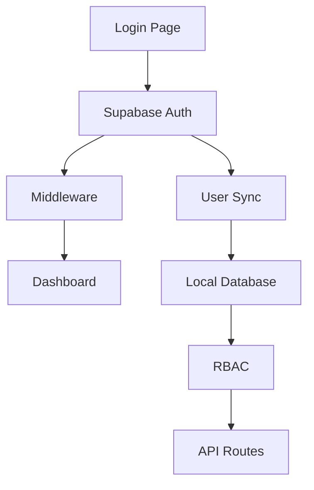

# ✅ Sistema de Autenticação

- **Status:** ✅ Completo
- **Versão:** 2.0.0
- **Data de criação:** 2026-02-10
- **Última atualização:** 2026-02-10
- **Responsável:** @openhands

## 📝 Visão Geral
Sistema de autenticação seguro e flexível usando Supabase Auth com email/senha, substituindo a solução anterior baseada em Google OAuth (NextAuth). A migração proporciona maior controle sobre o fluxo de autenticação e elimina a dependência de contas Google para acesso ao sistema.

### Problema que Resolve
- Dependência de contas Google para acesso ao sistema
- Complexidade de configuração do OAuth
- Limitações do NextAuth para cenários específicos de assistência técnica
- Necessidade de cadastro simples para funcionários sem conta Google corporativa

### User Stories
- **Como** funcionário de uma assistência técnica
- **Quero** me cadastrar no sistema com email e senha
- **Para** acessar o painel de controle sem necessidade de conta Google

- **Como** administrador do sistema
- **Quero** gerenciar usuários localmente
- **Para** controlar permissões e acessos (RBAC)

- **Como** desenvolvedor
- **Quero** uma solução de autenticação integrada ao Supabase
- **Para** simplificar a infraestrutura e aproveitar outros serviços (Storage, Realtime)

## 🏗️ Arquitetura

### Diagrama de Componentes


### Estrutura de Arquivos
```
src/
├── lib/
│   ├── supabase.ts          # Cliente Supabase (browser)
│   ├── supabase-server.ts   # Cliente Supabase (server)
│   └── auth-helpers.ts      # Helpers de autenticação
├── middleware.ts            # Middleware de proteção de rotas
└── app/
    ├── (auth)/login/page.tsx # Página de login/cadastro
    └── (dashboard)/         # Rotas protegidas
```

### Modelos de Dados (Prisma)
```prisma
model User {
  id            String         @id @default(cuid())
  authId        String         @unique // ID do usuário no Supabase Auth
  name          String
  email         String         @unique
  role          Role           @default(TECHNICIAN)
  active        Boolean        @default(true)
  createdAt     DateTime       @default(now())
  updatedAt     DateTime       @updatedAt
  sales         Sale[]
  serviceOrders ServiceOrder[]
}

enum Role {
  ADMIN
  TECHNICIAN
  RECEPTIONIST
}
```

## 💻 Implementação

### Frontend - Página de Login
```typescript
// src/app/(auth)/login/page.tsx
"use client";
import { createClient } from "@/lib/supabase";

export default function LoginPage() {
  const supabase = createClient();
  
  const handleLogin = async (email: string, password: string) => {
    const { data, error } = await supabase.auth.signInWithPassword({
      email,
      password,
    });
    
    if (error) throw error;
    if (data.user) router.push("/");
  };
  
  const handleSignUp = async (email: string, password: string) => {
    const { data, error } = await supabase.auth.signUp({
      email,
      password,
      options: { data: { full_name: email.split('@')[0] } },
    });
    
    if (error) throw error;
    if (data.user) router.push("/");
  };
}
```

### Backend - Sincronização de Usuários
```typescript
// src/lib/auth-helpers.ts
export async function syncUserWithDatabase() {
  const supabase = await createServerSupabaseClient();
  const { data: { user } } = await supabase.auth.getUser();
  
  if (!user) return null;
  
  // Sincroniza com banco local
  const existingUser = await prisma.user.findUnique({
    where: { authId: user.id }
  });
  
  if (!existingUser) {
    return await prisma.user.create({
      data: {
        authId: user.id,
        name: user.user_metadata?.full_name || user.email?.split('@')[0] || 'Usuário',
        email: user.email!,
        role: 'TECHNICIAN',
        active: true
      }
    });
  }
  
  return existingUser;
}
```

### Middleware - Proteção de Rotas
```typescript
// src/middleware.ts
export async function middleware(request: NextRequest) {
  const supabase = createServerClient(...);
  await supabase.auth.getSession(); // Refresh session
  
  const { data: { user } } = await supabase.auth.getUser();
  const isDashboardPage = request.nextUrl.pathname.startsWith('/dashboard');
  
  if (!user && isDashboardPage) {
    return NextResponse.redirect(new URL('/login', request.url));
  }
  
  if (user && request.nextUrl.pathname.startsWith('/login')) {
    return NextResponse.redirect(new URL('/', request.url));
  }
  
  return NextResponse.next();
}
```

## 🔌 API/Endpoints

### Autenticação (Supabase)
- **Login**: `POST /auth/v1/token?grant_type=password`
- **Cadastro**: `POST /auth/v1/signup`
- **Logout**: `POST /auth/v1/logout`
- **Sessão**: `GET /auth/v1/user`

### Sincronização Local
- **GET /api/user/sync** - Sincroniza usuário do Supabase com banco local
- **Middleware automático** - Todas as rotas protegidas verificam autenticação

## 🔒 Segurança

### Validações
- Email válido (formato)
- Senha mínima 6 caracteres
- Rate limiting nativo do Supabase
- Confirmação de email (opcional)

### Autenticação/Autorização (RBAC)
- **ADMIN**: Acesso completo
- **TECHNICIAN**: Acesso a OS, produtos, serviços
- **RECEPTIONIST**: Acesso a clientes, cadastro de OS

### Proteção de Dados
- Tokens JWT com expiração
- Refresh tokens automáticos
- Sessions gerenciadas pelo Supabase
- Cookies HTTP-only

## 🧪 Testes

### Unitários
```typescript
describe('syncUserWithDatabase', () => {
  it('should create new user when not exists', async () => {
    const mockUser = { id: 'auth123', email: 'test@email.com' };
    // Mock Supabase auth
    // Test creation flow
  });
  
  it('should return existing user', async () => {
    // Mock existing user
    // Test retrieval flow
  });
});
```

### Integração
```typescript
describe('Login Flow', () => {
  it('should redirect to dashboard after successful login', async () => {
    // Mock Supabase response
    // Test redirect
  });
  
  it('should show error on invalid credentials', async () => {
    // Mock error response
    // Test error handling
  });
});
```

## 🚀 Deploy

### Variáveis de Ambiente
```bash
# Supabase
NEXT_PUBLIC_SUPABASE_URL="https://seu-projeto.supabase.co"
NEXT_PUBLIC_SUPABASE_ANON_KEY="sua-chave-anon"

# Banco de Dados
DATABASE_URL="postgresql://..."

# Outras
NEXTAUTH_URL="http://localhost:3000"
NEXTAUTH_SECRET="sua-chave-secreta"
```

### Migrations
```bash
# Atualizar schema
npx prisma migrate dev --name add-authId-to-user

# Deploy
npx prisma migrate deploy
```

### Checklist
- [ ] Projeto Supabase criado
- [ ] Authentication → Email Provider habilitado
- [ ] Variáveis de ambiente configuradas
- [ ] Schema Prisma atualizado
- [ ] Build de produção OK
- [ ] Testes de login/cadastro
- [ ] RBAC funcionando

## 📊 Monitoramento & Troubleshooting

### Métricas Chave
- Taxa de sucesso de login: > 95%
- Tempo de resposta auth: < 500ms
- Usuários ativos/dia

### Problemas Comuns

**Erro: "Variáveis de ambiente não configuradas"**
```bash
# Verificar .env.local
cat .env.local
# Ou configurar na Vercel
```

**Erro: "authId não encontrado"**
```bash
# Regenerar Prisma Client
npx prisma generate
```

**Erro: "Usuário não sincronizado"**
- Verificar função `syncUserWithDatabase`
- Checar permissões do banco
- Verificar logs do Supabase

**Login não redireciona**
- Verificar middleware
- Checar callback URLs
- Verificar session refresh

## 🔄 Migração de Google OAuth para Supabase Auth

### Mudanças Realizadas
1. **Remoção do NextAuth**
   - Dependências: `next-auth`, `@auth/prisma-adapter`
   - Arquivos: `src/lib/auth.ts`, `src/app/api/auth/[...nextauth]`
   - Configurações Google OAuth

2. **Implementação Supabase Auth**
   - Dependências: `@supabase/supabase-js`, `@supabase/ssr`
   - Clientes: `supabase.ts` (browser), `supabase-server.ts` (server)
   - Helpers: `auth-helpers.ts` para sincronização

3. **Atualização do Schema**
   - Campo `authId` adicionado ao modelo `User`
   - Tabelas do NextAuth removidas (`Account`, `Session`, `VerificationToken`)
   - Relacionamentos mantidos

4. **Componentes Atualizados**
   - Página de login: Formulário email/senha + cadastro
   - Header: Logout com Supabase Auth
   - Providers: Simplificado (sem SessionProvider)
   - Middleware: Proteção de rotas

5. **API Routes Atualizadas**
   - `/api/sales`: Autenticação via Supabase
   - `/api/settings`: Verificação de role (ADMIN)
   - Outras rotas seguem mesmo padrão

### Benefícios da Migração
- ✅ **Simplicidade**: Email/senha nativo vs OAuth complexo
- ✅ **Controle**: Gerenciamento completo de usuários
- ✅ **Integração**: Parte do ecossistema Supabase
- ✅ **Custo**: Plano gratuito generoso
- ✅ **Segurança**: Autenticação robusta com RLS
- ✅ **Para assistências**: Cadastro simples sem conta Google

### Notas de Migração
- Usuários existentes precisam se recadastrar
- Dados históricos mantidos (relacionamentos por `authId`)
- RBAC mantido e funcional
- Build e deploy verificados